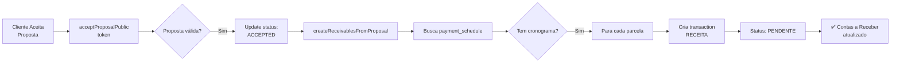

# 📋 Especificação Completa - CRM Zoomer

**Sistema de CRM para Produtoras de Vídeo**
**Versão:** 1.0.0 (Sprints 0-3 Completos)
**Data:** Janeiro 2026

---

## 🎯 Visão Geral do Sistema

O **CRM Zoomer** é um sistema completo de gestão para produtoras de vídeo e audiovisual, integrando vendas, projetos, equipe, equipamentos e finanças em uma única plataforma.

### Stack Tecnológica

- **Frontend:** Next.js 15 (App Router), React 19, TypeScript 5.9
- **Banco de Dados:** PostgreSQL (Supabase)
- **ORM:** Prisma 6.2
- **UI:** Tailwind CSS 3.4, shadcn/ui, Framer Motion 12.25
- **Estado:** Zustand, React Query
- **Autenticação:** Supabase Auth

---

## 🚀 Sprints Implementados

### ✅ Sprint 0: Fundação e Arquitetura

**Status:** 100% Completo

#### Banco de Dados Criado

**1. Organizations (Organizações)**
```sql
CREATE TABLE organizations (
  id TEXT PRIMARY KEY,
  name TEXT NOT NULL,
  logo TEXT,
  email TEXT,
  phone TEXT,
  website TEXT,
  max_discount DECIMAL(5,2) DEFAULT 10.00,
  created_at TIMESTAMP DEFAULT NOW(),
  updated_at TIMESTAMP DEFAULT NOW()
);
```

**2. Users (Usuários)**
```sql
CREATE TABLE users (
  id TEXT PRIMARY KEY,
  organization_id TEXT REFERENCES organizations(id),
  name TEXT NOT NULL,
  email TEXT UNIQUE NOT NULL,
  role TEXT CHECK (role IN ('ADMIN', 'MANAGER', 'PRODUCER', 'EDITOR')),
  avatar TEXT,
  created_at TIMESTAMP DEFAULT NOW()
);
```

**3. Clients (Clientes)**
```sql
CREATE TABLE clients (
  id TEXT PRIMARY KEY,
  organization_id TEXT REFERENCES organizations(id),
  name TEXT NOT NULL,
  company TEXT,
  email TEXT,
  phone TEXT,
  address TEXT,
  notes TEXT,
  created_at TIMESTAMP DEFAULT NOW(),
  updated_at TIMESTAMP DEFAULT NOW()
);
```

**4. Projects (Projetos)**
```sql
CREATE TABLE projects (
  id TEXT PRIMARY KEY,
  organization_id TEXT REFERENCES organizations(id),
  title TEXT NOT NULL,
  description TEXT,
  client_id TEXT REFERENCES clients(id),
  assigned_to_id TEXT REFERENCES users(id),
  status TEXT DEFAULT 'BRIEFING',
  deadline TIMESTAMP,
  shooting_date TIMESTAMP,
  location TEXT,
  budget DECIMAL(10,2),
  deliverables_description TEXT,
  created_at TIMESTAMP DEFAULT NOW(),
  updated_at TIMESTAMP DEFAULT NOW()
);
```

**5. Freelancers (Freelancers)**
```sql
CREATE TABLE freelancers (
  id TEXT PRIMARY KEY,
  organization_id TEXT REFERENCES organizations(id),
  name TEXT NOT NULL,
  email TEXT,
  phone TEXT,
  skills TEXT[],
  daily_rate DECIMAL(10,2),
  portfolio_url TEXT,
  notes TEXT,
  created_at TIMESTAMP DEFAULT NOW()
);
```

**6. Equipment (Equipamentos)**
```sql
CREATE TABLE equipment (
  id TEXT PRIMARY KEY,
  organization_id TEXT REFERENCES organizations(id),
  name TEXT NOT NULL,
  category TEXT,
  serial_number TEXT,
  purchase_date DATE,
  purchase_value DECIMAL(10,2),
  daily_rate DECIMAL(10,2),
  status TEXT DEFAULT 'AVAILABLE',
  notes TEXT,
  created_at TIMESTAMP DEFAULT NOW()
);
```

**7. Financial Transactions (Transações Financeiras)**
```sql
CREATE TABLE financial_transactions (
  id TEXT PRIMARY KEY,
  organization_id TEXT REFERENCES organizations(id),
  project_id TEXT REFERENCES projects(id),
  client_id TEXT REFERENCES clients(id),
  freelancer_id TEXT REFERENCES freelancers(id),
  proposal_id TEXT REFERENCES proposals(id),
  type TEXT CHECK (type IN ('RECEITA', 'DESPESA')),
  origin TEXT CHECK (origin IN ('PROJETO', 'PROPOSTA', 'MANUAL')),
  status TEXT DEFAULT 'PENDENTE',
  category TEXT,
  description TEXT NOT NULL,
  valor DECIMAL(10,2) NOT NULL,
  transaction_date DATE NOT NULL,
  due_date DATE,
  payment_method TEXT,
  created_at TIMESTAMP DEFAULT NOW(),
  updated_at TIMESTAMP DEFAULT NOW()
);
```

#### Funcionalidades Base

- ✅ Autenticação e gestão de usuários
- ✅ CRUD completo de clientes
- ✅ CRUD completo de projetos (Kanban + lista)
- ✅ CRUD completo de freelancers
- ✅ CRUD completo de equipamentos
- ✅ Dashboard financeiro básico
- ✅ Multi-tenancy (organizações)

---

### ✅ Sprint 1: Financeiro Core

**Status:** 100% Completo
**Documentação:** `SPRINT-1-IMPLEMENTATION.md` (se existir)

#### Módulo Financeiro Completo

**Funcionalidades:**
- ✅ Dashboard com KPIs (Saldo, Receitas, Despesas, Lucro)
- ✅ Gráfico de fluxo de caixa mensal
- ✅ Listagem de transações com filtros
- ✅ Categorização automática (CREW_TALENT, CLIENT_PAYMENT, EQUIPMENT_RENTAL, etc)
- ✅ Status tracking (PENDENTE, PAGO, CANCELADO)
- ✅ Origem rastreável (PROJETO, PROPOSTA, MANUAL)

**Categorias de Transação:**
```typescript
// Receitas
- CLIENT_PAYMENT (Pagamento de Cliente)
- PROJECT_INCOME (Receita de Projeto)
- OTHER_INCOME (Outras Receitas)

// Despesas
- CREW_TALENT (Equipe/Talento)
- EQUIPMENT_RENTAL (Aluguel de Equipamento)
- LOCATION (Locação)
- POST_PRODUCTION (Pós-Produção)
- MARKETING (Marketing)
- OPERATIONAL (Operacional)
- OTHER_EXPENSE (Outras Despesas)
```

**Server Actions:**
- `getFinancialTransactions()` - Listar transações
- `getFinancialSummary()` - Dashboard KPIs
- `addFinancialTransaction()` - Criar transação manual
- `updateFinancialTransaction()` - Atualizar transação
- `deleteFinancialTransaction()` - Deletar transação

---

### ✅ Sprint 2: Gestão de Projetos e Recursos

**Status:** 100% Completo
**Documentação:** [SPRINT-2-IMPLEMENTATION.md](SPRINT-2-IMPLEMENTATION.md)

#### Banco de Dados Estendido

**1. ShootingDate (Múltiplas Datas de Gravação)**
```sql
CREATE TABLE shooting_dates (
  id TEXT PRIMARY KEY,
  project_id TEXT REFERENCES projects(id) ON DELETE CASCADE,
  date TIMESTAMP NOT NULL,
  time TEXT,
  location TEXT,
  notes TEXT,
  created_at TIMESTAMP DEFAULT NOW(),
  updated_at TIMESTAMP DEFAULT NOW()
);

CREATE INDEX idx_shooting_dates_project ON shooting_dates(project_id);
```

**2. DeliveryDate (Múltiplas Datas de Entrega)**
```sql
CREATE TABLE delivery_dates (
  id TEXT PRIMARY KEY,
  project_id TEXT REFERENCES projects(id) ON DELETE CASCADE,
  date TIMESTAMP NOT NULL,
  description TEXT NOT NULL,
  completed BOOLEAN DEFAULT FALSE,
  created_at TIMESTAMP DEFAULT NOW(),
  updated_at TIMESTAMP DEFAULT NOW()
);

CREATE INDEX idx_delivery_dates_project ON delivery_dates(project_id);
```

**3. FreelancerAllocation (Alocação de Freelancers)**
```sql
ALTER TABLE freelancer_allocations ADD COLUMN custom_rate DECIMAL(10,2);
```

**4. Campo em Projects**
```sql
ALTER TABLE projects ADD COLUMN deliverables_description TEXT;
```

#### Componentes UI Criados

**1. DatesManager** ([src/components/projects/dates-manager.tsx](src/components/projects/dates-manager.tsx))
- Gerenciamento visual de múltiplas datas de gravação
- Gerenciamento visual de múltiplas datas de entrega
- Formulários inline com validação
- Animações Framer Motion
- Cards diferenciados por cor (azul para gravação, verde para entrega)

**2. EquipmentSelector** ([src/components/projects/equipment-selector.tsx](src/components/projects/equipment-selector.tsx))
- Seleção de equipamentos disponíveis
- Reserva com data início/fim
- Cálculo automático de valor (dailyRate × dias)
- Visual com tema roxo

**3. FreelancerSelector** ([src/components/projects/freelancer-selector.tsx](src/components/projects/freelancer-selector.tsx))
- Seleção de freelancers disponíveis
- Alocação por data
- **Edição inline de valor customizado**
- **Integração automática com "Contas a Pagar"**
- Callback `onPayableUpdate` para atualização financeira
- Visual com tema âmbar

#### Server Actions Adicionados

**Arquivo:** [src/actions/projects.ts](src/actions/projects.ts:393-498)

```typescript
// Datas de Gravação
addShootingDate(projectId, { date, time, location, notes })
deleteShootingDate(shootingDateId, projectId)

// Datas de Entrega
addDeliveryDate(projectId, { date, description, completed })
deleteDeliveryDate(deliveryDateId, projectId)
toggleDeliveryComplete(deliveryDateId, projectId, completed)
```

**Arquivo:** [src/actions/financeiro.ts](src/actions/financeiro.ts:475-557)

```typescript
// Integração Automática Freelancer → Financeiro
upsertFreelancerPayable({
  projectId,
  freelancerId,
  freelancerName,
  amount,
  date,
  organizationId
})
```

#### Regra de Negócio Crítica

**Freelancer → Contas a Pagar Automático:**

Quando um freelancer é alocado em um projeto ou tem seu valor editado:
1. Sistema busca transação existente (`project_id` + `freelancer_id` + `type=DESPESA`)
2. Se existe: **atualiza** `valor` e `transaction_date`
3. Se não existe: **cria** nova transação:
   - Type: `DESPESA`
   - Origin: `PROJETO`
   - Status: `PENDENTE`
   - Category: `CREW_TALENT`
   - Description: `"Pagamento freelancer: {nome}"`

**Resultado:** Contas a Pagar sempre sincronizado automaticamente! 💰

#### Melhorias na UI

**Projetos Kanban** ([src/components/projects/projects-kanban.tsx](src/components/projects/projects-kanban.tsx:166-300))
- Adicionada tabela completa abaixo do Kanban
- Colunas: Projeto, Cliente, Status, Gravação, Prazo, Ações
- Destaque de projetos atrasados (ícone vermelho)
- Acesso rápido a todos os projetos

---

### ✅ Sprint 3: Orçamentos e Propostas (Vendas)

**Status:** 100% Completo
**Documentação:** [SPRINT-3-IMPLEMENTATION.md](SPRINT-3-IMPLEMENTATION.md)

#### Banco de Dados Estendido

**1. Proposals (Propostas) - JÁ EXISTIA**
```sql
CREATE TABLE proposals (
  id TEXT PRIMARY KEY,
  token TEXT UNIQUE NOT NULL,
  organization_id TEXT REFERENCES organizations(id),
  client_id TEXT REFERENCES clients(id),
  title TEXT NOT NULL,
  description TEXT,
  base_value DECIMAL(10,2) DEFAULT 0,
  discount DECIMAL(5,2) DEFAULT 0,
  total_value DECIMAL(10,2) DEFAULT 0,
  status TEXT DEFAULT 'DRAFT',
  valid_until DATE,
  version INTEGER DEFAULT 1,
  sent_at TIMESTAMP,
  viewed_at TIMESTAMP,
  accepted_at TIMESTAMP,
  created_at TIMESTAMP DEFAULT NOW(),
  updated_at TIMESTAMP DEFAULT NOW()
);
```

**2. ProposalItems (Itens da Proposta) - JÁ EXISTIA**
```sql
CREATE TABLE proposal_items (
  id TEXT PRIMARY KEY,
  proposal_id TEXT REFERENCES proposals(id) ON DELETE CASCADE,
  description TEXT NOT NULL,
  quantity INTEGER NOT NULL,
  unit_price DECIMAL(10,2) NOT NULL,
  total DECIMAL(10,2) NOT NULL,
  order INTEGER NOT NULL,
  created_at TIMESTAMP DEFAULT NOW()
);
```

**3. ProposalOptionals (Opcionais) - JÁ EXISTIA**
```sql
CREATE TABLE proposal_optionals (
  id TEXT PRIMARY KEY,
  proposal_id TEXT REFERENCES proposals(id) ON DELETE CASCADE,
  title TEXT NOT NULL,
  description TEXT,
  price DECIMAL(10,2) NOT NULL,
  is_selected BOOLEAN DEFAULT FALSE,
  dependency TEXT,
  order INTEGER NOT NULL,
  created_at TIMESTAMP DEFAULT NOW()
);
```

**4. ProposalVideos (Vídeos Portfolio) - JÁ EXISTIA**
```sql
CREATE TABLE proposal_videos (
  id TEXT PRIMARY KEY,
  proposal_id TEXT REFERENCES proposals(id) ON DELETE CASCADE,
  title TEXT NOT NULL,
  video_url TEXT NOT NULL,
  order INTEGER NOT NULL,
  created_at TIMESTAMP DEFAULT NOW()
);
```

**5. PaymentSchedule (Cronograma de Pagamento) - NOVO (SPRINT 3)**
```sql
CREATE TABLE payment_schedule (
  id TEXT PRIMARY KEY,
  proposal_id TEXT REFERENCES proposals(id) ON DELETE CASCADE,
  description TEXT NOT NULL,
  due_date TIMESTAMP NOT NULL,
  amount DECIMAL(10,2) NOT NULL,
  percentage DECIMAL(5,2),
  order INTEGER NOT NULL,
  paid BOOLEAN DEFAULT FALSE,
  paid_at TIMESTAMP,
  created_at TIMESTAMP DEFAULT NOW(),
  updated_at TIMESTAMP DEFAULT NOW()
);

CREATE INDEX idx_payment_schedule_proposal ON payment_schedule(proposal_id);
CREATE INDEX idx_payment_schedule_due_date ON payment_schedule(due_date);
CREATE INDEX idx_payment_schedule_paid ON payment_schedule(paid);
```

**Migration:** [prisma/migrations/20260113050000_sprint3_payment_schedule/migration.sql](prisma/migrations/20260113050000_sprint3_payment_schedule/migration.sql)

#### Tipos TypeScript

**Arquivo:** [src/types/proposal.ts](src/types/proposal.ts)

```typescript
export interface ProposalItem {
  id?: string
  description: string
  quantity: number
  unitPrice: number
  total: number
  order: number
}

export interface ProposalOptional {
  id?: string
  title: string
  description?: string
  price: number
  isSelected?: boolean
  dependency?: string
}

export interface ProposalVideo {
  id?: string
  title: string
  videoUrl: string
  order: number
}

export interface PaymentScheduleItem {
  id?: string
  description: string
  dueDate: Date | string
  amount: number
  percentage?: number
  order: number
  paid?: boolean
  paidAt?: Date | string
}

export interface ProposalFormData {
  title: string
  description?: string
  clientId: string
  baseValue: number
  discount: number
  totalValue: number
  validUntil?: Date | string
  items: ProposalItem[]
  optionals: ProposalOptional[]
  portfolioVideos: ProposalVideo[]
  paymentSchedule: PaymentScheduleItem[]
}

export type ProposalStatus =
  | 'DRAFT'
  | 'SENT'
  | 'VIEWED'
  | 'ACCEPTED'
  | 'REJECTED'
  | 'EXPIRED'
```

#### Componente Principal: ProposalBuilder

**Arquivo:** [src/components/proposals/proposal-builder.tsx](src/components/proposals/proposal-builder.tsx) - **850+ linhas**

**Sistema completo de construção de propostas com 3 abas:**

**📦 Aba 1: Itens da Proposta**
- Formulário inline para adicionar itens
- Campos: Descrição, Quantidade, Valor Unitário
- Cálculo automático de total: `quantidade × preço`
- Lista de itens com botão de remoção
- Empty state visual
- Animações Framer Motion

**📅 Aba 2: Cronograma de Recebimento** ⭐
- Formulário para adicionar parcelas
- Campos: Descrição, Data Prevista, **Porcentagem (%)**, Valor (R$)
- **Cálculo automático:** Porcentagem → Valor em R$
- Validação: soma não pode exceder 100%
- Alerta informativo com valor total disponível
- Lista de parcelas com ícones visuais
- Exemplos de uso:
  - "Entrada (50%)" → Insere 50% → Calcula R$ automaticamente
  - "30 dias (25%)" → Parcela de 25% para daqui 30 dias
  - "60 dias (25%)" → Última parcela

**Auto-cálculo de Parcela:**
```typescript
useEffect(() => {
  if (newPayment.percentage && totalValue > 0) {
    setNewPayment((prev) => ({
      ...prev,
      amount: (totalValue * (prev.percentage || 0)) / 100,
    }))
  }
}, [newPayment.percentage, totalValue])
```

**📋 Aba 3: Serviços Opcionais**
- Formulário para adicionar opcionais
- Campos: Título, Descrição, Preço
- Cliente seleciona na página pública
- Valor **não** entra no total base (apenas se selecionado)

**💰 Resumo Financeiro** (Sempre Visível)
- Valor Base (soma de todos os itens)
- Desconto configurável (%)
- Desconto em R$ calculado automaticamente
- **Valor Total** em destaque (verde)
- Formatação monetária brasileira

**Fórmula:**
```
Valor Total = Valor Base - (Valor Base × Desconto%)
```

#### Server Actions Completas

**Arquivo:** [src/actions/proposals.ts](src/actions/proposals.ts) - **933 linhas, completamente reescrito**

**28 Funções Implementadas:**

**Propostas (CRUD + Ações):**
```typescript
// Busca
getProposals() // Lista todas da organização
getProposal(proposalId) // Busca por ID para edição
getProposalByToken(token) // Busca por token (página pública)

// CRUD
addProposal({ title, client_id, base_value, discount, description })
updateProposal(proposalId, { title, description, discount, valid_until })
deleteProposal(proposalId)

// Ações
sendProposal(proposalId) // Envia para cliente (status SENT)
approveProposal(proposalId) // Aprova internamente (status ACCEPTED)
rejectProposal(proposalId, reason) // Rejeita
duplicateProposal(proposalId) // Duplica proposta completa
```

**Página Pública:**
```typescript
toggleProposalOptional(proposalId, optionalId, isSelected)
acceptProposalPublic(token) // Cliente aceita proposta
```

**Itens (CRUD + Reordenação):**
```typescript
addProposalItem(proposalId, { description, quantity, unit_price })
updateProposalItem(itemId, { description, quantity, unit_price })
deleteProposalItem(itemId)
reorderProposalItems(proposalId, itemIds[])
```

**Opcionais (CRUD + Reordenação):**
```typescript
addProposalOptional(proposalId, { title, description, price, dependency })
updateProposalOptional(optionalId, { title, description, price })
deleteProposalOptional(optionalId)
reorderProposalOptionals(proposalId, optionalIds[])
```

**Vídeos (CRUD + Reordenação):**
```typescript
addProposalVideo(proposalId, { title, video_url })
updateProposalVideo(videoId, { title, video_url })
deleteProposalVideo(videoId)
reorderProposalVideos(proposalId, videoIds[])
```

**Sprint 3 - Cronograma de Pagamento:**
```typescript
addPaymentSchedule(proposalId, {
  description,
  dueDate,
  amount,
  percentage,
  order
})

createReceivablesFromProposal(proposalId) // ⭐ FUNÇÃO CRÍTICA
```

#### Regra de Negócio Crítica do Sprint 3

**Aceitar Proposta → Criar "Contas a Receber" Automaticamente**

**Fluxo:**


**Implementação:**

```typescript
export async function createReceivablesFromProposal(proposalId: string) {
  const supabase = await createClient()

  // Buscar proposta e cronograma
  const { data: proposal } = await supabase
    .from('proposals')
    .select('*, payment_schedule(*)')
    .eq('id', proposalId)
    .single()

  if (!proposal.payment_schedule || proposal.payment_schedule.length === 0) {
    throw new Error('Proposta não possui cronograma de pagamento')
  }

  // Criar uma transação para cada parcela
  const transactions = proposal.payment_schedule.map((payment: any) => ({
    organization_id: proposal.organization_id,
    proposal_id: proposal.id,
    client_id: proposal.client_id,
    type: 'RECEITA',
    origin: 'PROPOSTA',
    status: 'PENDENTE',
    category: 'CLIENT_PAYMENT',
    description: `${payment.description} - ${proposal.title}`,
    valor: payment.amount,
    transaction_date: new Date().toISOString().split('T')[0],
    due_date: payment.due_date,
  }))

  await supabase
    .from('financial_transactions')
    .insert(transactions)

  revalidatePath('/financeiro')
  return transactions.length
}
```

**Resultado:**
- ✅ Proposta aceita → Status `ACCEPTED`
- ✅ Para cada parcela → Cria `financial_transaction`:
  - Type: `RECEITA`
  - Origin: `PROPOSTA`
  - Status: `PENDENTE`
  - Category: `CLIENT_PAYMENT`
  - Valor: valor da parcela
  - Due Date: data de vencimento
- ✅ Todas as parcelas aparecem em **Financeiro → Contas a Receber**
- ✅ Podem ser marcadas como PAGO manualmente depois

---

## 🎯 Fluxos de Integração Principais

### Fluxo 1: Projeto → Freelancer → Financeiro

```
1. Usuário cria projeto
2. Usuário aloca freelancer com valor customizado
3. FreelancerSelector chama onPayableUpdate()
4. Sistema chama upsertFreelancerPayable()
5. Cria/atualiza transação em financial_transactions
   - Type: DESPESA
   - Origin: PROJETO
   - Status: PENDENTE
   - Category: CREW_TALENT
6. Transação aparece em "Contas a Pagar"
```

### Fluxo 2: Proposta → Aceitação → Financeiro

```
1. Usuário cria proposta com ProposalBuilder
2. Adiciona itens, opcionais e cronograma de pagamento
3. Proposta enviada para cliente (status: SENT)
4. Cliente acessa página pública /p/{token}
5. Cliente aceita proposta
6. Sistema chama acceptProposalPublic(token)
7. Status muda para ACCEPTED
8. Sistema chama createReceivablesFromProposal()
9. Para cada parcela do cronograma:
   - Cria transaction em financial_transactions
   - Type: RECEITA
   - Origin: PROPOSTA
   - Status: PENDENTE
10. Todas as parcelas aparecem em "Contas a Receber"
```

---

## 📊 Estrutura de Arquivos do Projeto

```
zooming-crm/
├── prisma/
│   ├── schema.prisma
│   └── migrations/
│       ├── 20260113044133_sprint2_shooting_delivery_dates/
│       └── 20260113050000_sprint3_payment_schedule/
├── src/
│   ├── actions/
│   │   ├── projects.ts (Sprint 2: +5 funções)
│   │   ├── financeiro.ts (Sprint 2: +1 função)
│   │   └── proposals.ts (Sprint 3: 933 linhas, 28 funções)
│   ├── components/
│   │   ├── projects/
│   │   │   ├── dates-manager.tsx (Sprint 2: NOVO)
│   │   │   ├── equipment-selector.tsx (Sprint 2: NOVO)
│   │   │   ├── freelancer-selector.tsx (Sprint 2: NOVO)
│   │   │   ├── project-form-modal.tsx (Sprint 2: ATUALIZADO)
│   │   │   └── projects-kanban.tsx (Sprint 2: ATUALIZADO)
│   │   └── proposals/
│   │       └── proposal-builder.tsx (Sprint 3: NOVO, 850+ linhas)
│   ├── types/
│   │   ├── project.ts (Sprint 2: NOVO)
│   │   └── proposal.ts (Sprint 3: NOVO)
│   └── lib/
│       └── supabase/
│           └── server.ts
├── SPRINT-2-IMPLEMENTATION.md (471 linhas)
├── SPRINT-3-IMPLEMENTATION.md (460 linhas)
└── especificacao_atualizada.md (este arquivo)
```

---

## 🧪 Cenários de Teste Principais

### Teste 1: Criar Projeto com Múltiplas Datas

**Pré-condição:**
- Usuário autenticado
- Cliente cadastrado

**Passos:**
1. Acessar `/projects`
2. Clicar "Novo Projeto"
3. Preencher título, cliente, descrição
4. Na seção "Datas de Gravação":
   - Adicionar data 1: 2026-02-10, 09:00, "Escritório cliente"
   - Adicionar data 2: 2026-02-11, 14:00, "Estúdio externo"
5. Na seção "Datas de Entrega":
   - Adicionar entrega 1: 2026-02-20, "Vídeo 30s Instagram"
   - Adicionar entrega 2: 2026-02-25, "Vídeo 2min YouTube"
6. Preencher "Resumo de Entregáveis": "1 vídeo 30s Instagram, 1 vídeo 2min YouTube"
7. Salvar projeto

**Resultado Esperado:**
- ✅ Projeto criado com sucesso
- ✅ 2 datas de gravação vinculadas
- ✅ 2 datas de entrega vinculadas
- ✅ Dados aparecem na visualização do projeto

### Teste 2: Alocar Freelancer e Verificar Financeiro

**Pré-condição:**
- Projeto criado
- Freelancer cadastrado (ex: João Silva, R$ 500/dia)

**Passos:**
1. Acessar detalhes do projeto
2. Na seção "Equipe", usar FreelancerSelector
3. Selecionar "João Silva"
4. Data: 2026-02-10
5. Valor customizado: R$ 600 (diferente do padrão)
6. Confirmar alocação
7. Acessar `/financeiro`
8. Ir em "Contas a Pagar"

**Resultado Esperado:**
- ✅ Freelancer alocado no projeto
- ✅ Nova transação criada automaticamente:
  - Descrição: "Pagamento freelancer: João Silva"
  - Valor: R$ 600,00
  - Tipo: DESPESA
  - Status: PENDENTE
  - Categoria: CREW_TALENT
  - Origem: PROJETO

### Teste 3: Editar Valor do Freelancer

**Pré-condição:**
- Teste 2 completo

**Passos:**
1. Na mesma página do projeto
2. Clicar no ícone de editar (✏️) ao lado do valor R$ 600
3. Alterar para R$ 700
4. Confirmar (✓)
5. Acessar `/financeiro`
6. Ir em "Contas a Pagar"

**Resultado Esperado:**
- ✅ Valor atualizado na alocação
- ✅ Mesma transação atualizada (não duplicada):
  - Valor: R$ 700,00 (atualizado)
  - Status: continua PENDENTE
  - Todos os outros campos inalterados

### Teste 4: Criar Proposta Completa

**Pré-condição:**
- Cliente cadastrado

**Passos:**
1. Acessar página de criar proposta
2. Usar `<ProposalBuilder />`
3. **Aba Itens:**
   - Item 1: "Pré-produção e roteiro", 1 un, R$ 2.000 = R$ 2.000
   - Item 2: "Filmagem (1 dia)", 1 un, R$ 5.000 = R$ 5.000
   - Item 3: "Edição e finalização", 1 un, R$ 3.000 = R$ 3.000
   - **Valor Base: R$ 10.000**
4. **Aba Cronograma:**
   - Parcela 1: "Entrada (50%)", 50%, 2026-01-20 → R$ 5.000
   - Parcela 2: "30 dias (25%)", 25%, 2026-02-20 → R$ 2.500
   - Parcela 3: "60 dias (25%)", 25%, 2026-03-20 → R$ 2.500
5. **Aba Opcionais:**
   - Opcional 1: "Filmagem com Drone", R$ 1.500
   - Opcional 2: "Motion Graphics", R$ 2.000
6. **Resumo:**
   - Ajustar desconto: 10%
   - **Valor Total: R$ 9.000**
7. Salvar proposta

**Resultado Esperado:**
- ✅ Proposta criada com status DRAFT
- ✅ Token único gerado
- ✅ 3 itens vinculados
- ✅ 3 parcelas no cronograma
- ✅ 2 opcionais vinculados
- ✅ base_value: 10000
- ✅ discount: 10
- ✅ total_value: 9000

### Teste 5: Cliente Aceita Proposta → Integração Financeira

**Pré-condição:**
- Teste 4 completo
- Proposta com status SENT

**Passos:**
1. Obter token da proposta (ex: `prop_1736748000_abc123`)
2. Acessar `/p/prop_1736748000_abc123` (página pública)
3. Visualizar proposta completa
4. Clicar "Aceitar Proposta"
5. Acessar `/financeiro` (área admin)
6. Ir em "Contas a Receber"

**Resultado Esperado:**
- ✅ Proposta status alterado: SENT → ACCEPTED
- ✅ accepted_at preenchido
- ✅ **3 transações criadas automaticamente:**

  **Transação 1:**
  - Descrição: "Entrada (50%) - {título proposta}"
  - Valor: R$ 5.000,00
  - Tipo: RECEITA
  - Status: PENDENTE
  - Categoria: CLIENT_PAYMENT
  - Vencimento: 2026-01-20
  - Origem: PROPOSTA

  **Transação 2:**
  - Descrição: "30 dias (25%) - {título proposta}"
  - Valor: R$ 2.500,00
  - Vencimento: 2026-02-20
  - (mesmos atributos)

  **Transação 3:**
  - Descrição: "60 dias (25%) - {título proposta}"
  - Valor: R$ 2.500,00
  - Vencimento: 2026-03-20
  - (mesmos atributos)

### Teste 6: Validação de Porcentagens no Cronograma

**Pré-condição:**
- Criando nova proposta
- Valor total: R$ 10.000

**Passos:**
1. Na aba Cronograma, adicionar:
   - Parcela 1: 50% → R$ 5.000 ✅
   - Parcela 2: 30% → R$ 3.000 ✅
   - Parcela 3: 30% → R$ 3.000 ❌

**Resultado Esperado:**
- ✅ Sistema exibe alerta: "Total das parcelas (110%) excede 100%"
- ✅ Não permite adicionar parcela 3
- ✅ Usuário deve ajustar para 20% para completar 100%

### Teste 7: Cálculo Automático de Parcela

**Pré-condição:**
- ProposalBuilder aberto
- Valor total: R$ 8.500

**Passos:**
1. Aba Cronograma
2. Preencher descrição: "Entrada"
3. Preencher porcentagem: 40
4. Observar campo "Valor"

**Resultado Esperado:**
- ✅ Campo valor atualiza automaticamente para R$ 3.400,00
- ✅ Cálculo: 8.500 × 0.40 = 3.400

### Teste 8: Alterar Desconto e Recalcular Parcelas

**Pré-condição:**
- Proposta com:
  - Valor Base: R$ 10.000
  - Desconto: 0%
  - Total: R$ 10.000
  - Parcela 1: 50% → R$ 5.000

**Passos:**
1. No resumo financeiro, alterar desconto para 10%
2. Observar Total (deve mudar para R$ 9.000)
3. Observar valor da Parcela 1

**Resultado Esperado:**
- ✅ Total atualizado: R$ 9.000
- ✅ Parcela 1 mantém 50% mas valor recalcula: R$ 4.500
- ⚠️ **Nota:** Parcelas já salvas não recalculam. Apenas novas parcelas usam o novo total.

### Teste 9: Duplicar Proposta

**Pré-condição:**
- Proposta existente com itens, opcionais e cronograma

**Passos:**
1. Acessar lista de propostas
2. Clicar "Duplicar" na proposta desejada
3. Sistema cria cópia
4. Verificar nova proposta

**Resultado Esperado:**
- ✅ Nova proposta criada com título "{original} (Cópia)"
- ✅ Status: DRAFT
- ✅ Novo token gerado
- ✅ Todos os itens duplicados
- ✅ Todos os opcionais duplicados (is_selected resetado para false)
- ✅ Cronograma **não** duplicado (precisa criar novo)
- ✅ Cliente e organização mantidos

---

## 📈 Métricas de Qualidade

### Cobertura de Funcionalidades

| Módulo | Status | Completude |
|--------|--------|------------|
| Autenticação | ✅ | 100% |
| Clientes | ✅ | 100% |
| Projetos (CRUD) | ✅ | 100% |
| Projetos (Múltiplas datas) | ✅ | 100% |
| Freelancers | ✅ | 100% |
| Equipamentos | ✅ | 100% |
| Financeiro (Dashboard) | ✅ | 100% |
| Financeiro (Transações) | ✅ | 100% |
| Integração Freelancer → Financeiro | ✅ | 100% |
| Propostas (CRUD) | ✅ | 100% |
| Propostas (Itens/Opcionais/Vídeos) | ✅ | 100% |
| Construtor de Orçamento | ✅ | 100% |
| Cronograma de Pagamento | ✅ | 100% |
| Integração Proposta → Financeiro | ✅ | 100% |
| Página Pública de Proposta | ⏳ | 0% (Sprint 4) |

### Arquivos por Sprint

| Sprint | Arquivos Criados | Arquivos Modificados | Total Linhas |
|--------|------------------|---------------------|--------------|
| Sprint 0 | 20+ | 0 | ~5000 |
| Sprint 1 | 5 | 3 | ~800 |
| Sprint 2 | 6 | 5 | ~1500 |
| Sprint 3 | 3 | 2 | ~1800 |
| **Total** | **34+** | **10** | **~9100** |

---

## 🚀 Próximos Passos (Sprint 4)

### Sprint 4: Integração Total e Calendário

**Funcionalidades Planejadas:**

1. **Página Pública de Proposta** (`/p/{token}`)
   - Interface mobile-first
   - Visualização completa da proposta
   - Seleção de opcionais com checkboxes
   - Botão "Aceitar Proposta"
   - Vídeos do portfolio
   - Branding da organização

2. **Dashboard de Propostas**
   - Página `/proposals` com lista
   - Filtros por status
   - Métricas de conversão
   - Gráficos de propostas por mês

3. **Calendário Sincronizado**
   - Aba "Calendário" no projeto
   - Exibe todas as datas:
     - Gravações
     - Entregas
     - Compromissos
   - Integração com Google Calendar (opcional)

4. **Gestão de Status Financeiro**
   - Marcar transação como PAGA
   - Filtrar por data/período
   - Exportar relatórios

5. **Notificações por Email**
   - Email ao enviar proposta
   - Email ao aceitar proposta
   - Email de vencimento de parcela

---

## 🔐 Considerações de Segurança

### Autenticação
- ✅ Todas as rotas protegidas por Supabase Auth
- ✅ RLS (Row Level Security) no Supabase
- ✅ Server Actions com `'use server'`

### Validação
- ✅ Validação de dados em Server Actions
- ✅ Tratamento de erros consistente
- ✅ Mensagens de erro amigáveis

### Multi-tenancy
- ✅ Todas as queries filtradas por `organization_id`
- ⚠️ Atualmente hardcoded como `'org_demo'` (TODO: pegar do contexto)

### SQL Injection
- ✅ Uso de Prisma ORM (prepared statements)
- ✅ Nenhuma query raw SQL exposta

---

## 📚 Glossário de Termos

| Termo | Definição |
|-------|-----------|
| **CRUD** | Create, Read, Update, Delete |
| **Server Action** | Função server-side do Next.js 15 |
| **RLS** | Row Level Security (segurança a nível de linha) |
| **Supabase** | Backend-as-a-Service (PostgreSQL + Auth) |
| **Prisma** | ORM (Object-Relational Mapping) |
| **Kanban** | Quadro visual para gestão de projetos |
| **Upsert** | Update or Insert (atualiza se existe, cria se não) |
| **Token** | Identificador único para acesso público |
| **Revalidate** | Atualizar cache do Next.js |
| **Freelancer** | Profissional autônomo contratado por projeto |
| **Proposal** | Orçamento/Proposta comercial |
| **Optional** | Item opcional que cliente pode contratar |
| **Payment Schedule** | Cronograma de recebimento/parcelas |
| **Receivable** | Conta a Receber (receita futura) |
| **Payable** | Conta a Pagar (despesa futura) |

---

## 📞 Informações de Suporte

**Documentações dos Sprints:**
- [SPRINT-2-IMPLEMENTATION.md](SPRINT-2-IMPLEMENTATION.md) - Gestão de Projetos e Recursos
- [SPRINT-3-IMPLEMENTATION.md](SPRINT-3-IMPLEMENTATION.md) - Orçamentos e Propostas

**Banco de Dados:**
- Schema completo: `prisma/schema.prisma`
- Migrations: `prisma/migrations/`

**Ambiente de Desenvolvimento:**
```bash
# Instalar dependências
npm install

# Aplicar migrations
npx prisma migrate deploy
npx prisma generate

# Rodar desenvolvimento
npm run dev

# Build
npm run build
```

---

**Versão:** 1.0.0
**Última Atualização:** 13/01/2026
**Sprints Completos:** 0, 1, 2, 3
**Próximo Sprint:** 4

---

**Fim da Especificação** 🎉
