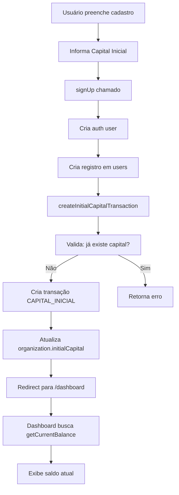
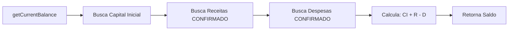

# SPRINT 0 - SISTEMA FINANCEIRO BASE
## Implementação do Capital Inicial e Fundação

**Data**: 2026-01-12
**Status**: ✅ Implementado (Backend + Estrutura de Dados)
**Próximo Sprint**: Integração com UI de Cadastro

---

## 📋 Índice

1. [Resumo Executivo](#resumo-executivo)
2. [Arquitetura Implementada](#arquitetura-implementada)
3. [Modelagem de Dados](#modelagem-de-dados)
4. [Funções Principais](#funções-principais)
5. [Como Integrar no Cadastro](#como-integrar-no-cadastro)
6. [Testes e Validação](#testes-e-validação)
7. [Próximos Sprints](#próximos-sprints)
8. [Pontos de Atenção](#pontos-de-atenção)

---

## 🎯 Resumo Executivo

### O que foi implementado?

Este SPRINT 0 estabelece a **fundação do sistema financeiro** do CRM Zoomer:

- ✅ **Tabela de transações financeiras** (`financial_transactions`)
- ✅ **Campos de capital inicial** na organização
- ✅ **Função para calcular saldo atual** dinamicamente
- ✅ **View agregada** com resumo financeiro
- ✅ **Server actions** para criar capital inicial
- ✅ **Helper functions** para cálculos financeiros
- ✅ **Schema Prisma** atualizado

### Regra de Negócio Central

> **O capital inicial NÃO é apenas um campo de configuração.**
>
> É um **evento financeiro** que deve ser registrado como a primeira transação do sistema, permitindo rastreabilidade completa e servindo como base para todos os cálculos de saldo.

### Fórmula do Saldo

```
Saldo Atual = Capital Inicial + Σ(Receitas Confirmadas) - Σ(Despesas Confirmadas)
```

---

## 🏗️ Arquitetura Implementada

### Stack Técnica

- **Backend**: Next.js 16 Server Actions
- **ORM**: Prisma (sincronizado)
- **Banco**: PostgreSQL via Supabase
- **Segurança**: Row Level Security (RLS) habilitado

### Estrutura de Arquivos

```
/zooming-crm/
├── prisma/
│   └── schema.prisma                    # ✅ Atualizado com FinancialTransaction
├── src/
│   ├── actions/
│   │   └── financeiro.ts                # ✅ Server actions + SPRINT 0
│   └── lib/
│       └── financial.ts                 # ✅ Helper functions
└── sprint-0-financial-foundation.sql    # ✅ Migration SQL completa
```

---

## 💾 Modelagem de Dados

### 1. Tabela: `financial_transactions`

**Propósito**: Registrar TODAS as movimentações financeiras do sistema.

```prisma
model FinancialTransaction {
  id              String            @id @default(cuid())
  organizationId  String
  organization    Organization      @relation(...)

  // Relacionamentos opcionais
  projectId       String?
  proposalId      String?
  clientId        String?

  // Classificação
  type            TransactionType   // CAPITAL_INICIAL | RECEITA | DESPESA | TRANSFERENCIA
  origin          TransactionOrigin // CADASTRO | PROJETO | MANUAL | PROPOSTA | SISTEMA
  status          TransactionStatus // CONFIRMADO | PENDENTE | AGENDADO | CANCELADO

  // Valores
  valor           Decimal           @db.Decimal(12, 2)

  // Metadata
  description     String
  category        String?
  notes           String?
  metadata        Json?

  // Datas
  transactionDate DateTime          @default(now())
  dueDate         DateTime?

  // Auditoria
  createdBy       String?
  createdAt       DateTime          @default(now())
  updatedAt       DateTime          @updatedAt

  @@index([organizationId, type, status])
  @@map("financial_transactions")
}
```

### 2. Enums

```prisma
enum TransactionType {
  CAPITAL_INICIAL  // Registro do capital inicial
  RECEITA          // Receita de projeto/venda
  DESPESA          // Despesa operacional
  TRANSFERENCIA    // Movimentação entre contas (futuro)
}

enum TransactionOrigin {
  CADASTRO  // Criado no cadastro (capital inicial)
  PROJETO   // Vinculado a um projeto
  MANUAL    // Lançamento manual
  PROPOSTA  // Vinculado a uma proposta aceita
  SISTEMA   // Criado automaticamente
}

enum TransactionStatus {
  CONFIRMADO  // Transação realizada
  PENDENTE    // Aguardando confirmação
  AGENDADO    // Agendado para data futura
  CANCELADO   // Transação cancelada
}
```

### 3. Campos Adicionados em `Organization`

```prisma
model Organization {
  // ... campos existentes

  // SPRINT 0 - Financeiro
  initialCapital      Decimal?  @db.Decimal(12, 2)
  initialCapitalSetAt DateTime?

  financialTransactions FinancialTransaction[]
}
```

### 4. View SQL: `financial_summary`

View agregada para consultas rápidas de saldo e estatísticas:

```sql
CREATE OR REPLACE VIEW financial_summary AS
SELECT
  o.id as organization_id,
  o.name as organization_name,
  o.initial_capital,

  -- Transação de capital inicial
  (SELECT valor FROM financial_transactions
   WHERE organization_id = o.id AND type = 'capital_inicial'
   LIMIT 1) as capital_inicial_transaction,

  -- Totais confirmados
  SUM(valor) FILTER (WHERE type = 'receita' AND status = 'confirmado') as total_receitas,
  SUM(ABS(valor)) FILTER (WHERE type = 'despesa' AND status = 'confirmado') as total_despesas,

  -- Pendentes
  SUM(valor) FILTER (WHERE type = 'receita' AND status IN ('pendente', 'agendado')) as receitas_pendentes,
  SUM(ABS(valor)) FILTER (WHERE type = 'despesa' AND status IN ('pendente', 'agendado')) as despesas_pendentes,

  -- Saldo calculado
  calculate_current_balance(o.id) as saldo_atual,

  -- Contadores
  COUNT(*) FILTER (WHERE type = 'receita') as total_receitas_count,
  COUNT(*) FILTER (WHERE type = 'despesa') as total_despesas_count,

  MAX(created_at) as ultima_transacao

FROM organizations o
LEFT JOIN financial_transactions ft ON o.id = ft.organization_id
GROUP BY o.id;
```

---

## ⚙️ Funções Principais

### 1. Server Actions (`src/actions/financeiro.ts`)

#### `createInitialCapitalTransaction()`

**Propósito**: Criar a transação de capital inicial no cadastro.

```typescript
export async function createInitialCapitalTransaction(
  organizationId: string,
  valor: number,
  createdBy?: string
): Promise<{
  success: boolean
  message: string
  transactionId?: string
}>
```

**Validações**:
- Verifica se já existe capital inicial registrado
- Valida que o valor não é negativo
- Cria transação tipo `CAPITAL_INICIAL`
- Atualiza o campo `initialCapital` na organização

**Exemplo de uso**:
```typescript
const result = await createInitialCapitalTransaction(
  'org_123',
  50000.00, // R$ 50.000,00
  'user_456'
)

if (result.success) {
  console.log('Capital inicial registrado!', result.transactionId)
}
```

#### `getCurrentBalance()`

**Propósito**: Calcular o saldo atual do caixa.

```typescript
export async function getCurrentBalance(
  organizationId: string
): Promise<number>
```

**Lógica**:
```
Saldo = Capital Inicial + Σ(Receitas CONFIRMADO) - Σ(Despesas CONFIRMADO)
```

#### `checkHasInitialCapital()`

**Propósito**: Verificar se a organização já possui capital inicial.

```typescript
export async function checkHasInitialCapital(
  organizationId: string
): Promise<boolean>
```

#### `getFinancialSummaryV2()`

**Propósito**: Buscar resumo financeiro completo da view agregada.

```typescript
export async function getFinancialSummaryV2(organizationId: string)
```

**Retorna**:
```typescript
{
  organizationId: string
  organizationName: string
  initialCapital: number
  capitalInicialTransaction: number
  totalReceitas: number
  totalDespesas: number
  receitasPendentes: number
  despesasPendentes: number
  saldoAtual: number          // ⭐ Calculado dinamicamente
  totalReceitasCount: number
  totalDespesasCount: number
  ultimaTransacao: Date | null
}
```

### 2. Helper Functions (`src/lib/financial.ts`)

#### Funções Disponíveis

```typescript
// Cálculo de saldo
calculateCurrentBalance(organizationId: string): Promise<number>

// Resumo financeiro
getFinancialSummary(organizationId: string): Promise<FinancialSummary | null>

// Verificações
hasInitialCapital(organizationId: string): Promise<boolean>

// Buscar transações
getTransactions(
  organizationId: string,
  filters?: {
    type?: TransactionType
    status?: TransactionStatus
    startDate?: Date
    endDate?: Date
  }
): Promise<FinancialTransaction[]>

// Formatação
formatCurrency(value: number): string // R$ 1.234,56

// Validações
validateAmount(amount: number, allowNegative?: boolean): boolean
calculatePercentage(value: number, total: number): number

// Projeções
getProjectedBalance(organizationId: string): Promise<{
  currentBalance: number
  projectedBalance: number
  scheduledIncome: number
  scheduledExpenses: number
}>
```

### 3. Função SQL: `calculate_current_balance()`

Função PostgreSQL que calcula o saldo diretamente no banco.

```sql
SELECT calculate_current_balance('org_123');
-- Retorna: 47500.00
```

**Vantagem**: Pode ser usada em views, triggers e queries complexas.

---

## 🔗 Como Integrar no Cadastro

### Cenário: Usuário está criando conta

#### Passo 1: Adicionar campo na UI de cadastro

No arquivo [`src/app/login/page.tsx`](src/app/login/page.tsx:1):

```tsx
'use client'

import { useState } from 'react'
import { createInitialCapitalTransaction } from '@/actions/financeiro'

export default function SignUpPage() {
  const [formData, setFormData] = useState({
    // ... campos existentes
    capitalInicial: '',
  })

  return (
    <form onSubmit={handleSubmit}>
      {/* ... campos existentes (nome, email, senha) */}

      {/* Novo campo: Capital Inicial */}
      <div>
        <label>Capital Inicial (R$)</label>
        <input
          type="number"
          step="0.01"
          min="0"
          value={formData.capitalInicial}
          onChange={(e) =>
            setFormData({ ...formData, capitalInicial: e.target.value })
          }
          placeholder="50000.00"
        />
        <p className="text-sm text-zinc-400">
          Informe o saldo atual da sua conta bancária empresarial
        </p>
      </div>

      <button type="submit">Criar Conta</button>
    </form>
  )
}
```

#### Passo 2: Modificar a função `signUp` em [`src/actions/auth.ts`](src/actions/auth.ts:24)

```typescript
'use server'

import { createClient } from '@/lib/supabase/server'
import { createInitialCapitalTransaction } from '@/actions/financeiro'

export async function signUp(
  email: string,
  password: string,
  name: string,
  whatsapp?: string,
  capitalInicial?: number  // ⬅️ Novo parâmetro
) {
  const supabase = await createClient()

  // 1. Criar autenticação
  const { data: authData, error: authError } = await supabase.auth.signUp({
    email,
    password,
    options: { data: { name, whatsapp } },
  })

  if (authError) throw new Error(authError.message)

  // 2. Criar organização (se ainda não existir)
  const organizationId = 'org_demo' // Ou criar nova organização

  // 3. Criar usuário na tabela
  if (authData.user) {
    const { error: userError } = await supabase.from('users').insert([
      {
        id: authData.user.id,
        email: authData.user.email,
        name,
        organization_id: organizationId,
      },
    ])

    if (userError) throw new Error('Erro ao criar usuário')

    // 4. ⭐ Criar transação de capital inicial
    if (capitalInicial && capitalInicial > 0) {
      const result = await createInitialCapitalTransaction(
        organizationId,
        capitalInicial,
        authData.user.id
      )

      if (!result.success) {
        console.error('Erro ao criar capital inicial:', result.message)
        // Não falhar o cadastro, apenas logar o erro
      }
    }
  }

  return { success: true }
}
```

#### Passo 3: Exibir saldo no Dashboard

```typescript
// src/app/(dashboard)/dashboard/page.tsx

import { getCurrentBalance } from '@/actions/financeiro'

export default async function DashboardPage() {
  const user = await getUser()
  const saldoAtual = await getCurrentBalance(user.organizationId)

  return (
    <div>
      <h1>Dashboard</h1>

      <div className="card">
        <h2>Saldo em Caixa</h2>
        <p className="text-3xl font-bold">
          {formatCurrency(saldoAtual)}
        </p>
      </div>

      {/* ... resto do dashboard */}
    </div>
  )
}
```

---

## 🧪 Testes e Validação

### 1. Executar Migration SQL

```bash
# Conectar ao banco Supabase
psql "postgresql://..."

# Executar migration
\i sprint-0-financial-foundation.sql

# Verificar tabelas criadas
\dt financial_transactions
```

### 2. Testar Criação de Capital Inicial

```sql
-- Via função SQL
SELECT * FROM create_initial_capital_transaction(
  'org_demo',  -- organization_id
  50000.00,    -- valor
  NULL         -- created_by
);

-- Verificar transação criada
SELECT * FROM financial_transactions
WHERE type = 'capital_inicial';
```

### 3. Testar Cálculo de Saldo

```sql
-- Criar receita e despesa de teste
INSERT INTO financial_transactions (
  organization_id, type, origin, status, valor, description
) VALUES
  ('org_demo', 'receita', 'manual', 'confirmado', 10000, 'Projeto XYZ'),
  ('org_demo', 'despesa', 'manual', 'confirmado', 3000, 'Equipamento');

-- Calcular saldo
SELECT calculate_current_balance('org_demo');
-- Esperado: 50000 + 10000 - 3000 = 57000
```

### 4. Testar Server Actions (TypeScript)

```typescript
// Em um componente ou teste
import {
  createInitialCapitalTransaction,
  getCurrentBalance,
  getFinancialSummaryV2
} from '@/actions/financeiro'

// Teste 1: Criar capital inicial
const result = await createInitialCapitalTransaction('org_test', 100000, 'user_123')
console.assert(result.success === true)

// Teste 2: Verificar saldo
const balance = await getCurrentBalance('org_test')
console.assert(balance === 100000)

// Teste 3: Buscar resumo
const summary = await getFinancialSummaryV2('org_test')
console.assert(summary.saldoAtual === 100000)
```

### 5. Testar View Agregada

```sql
SELECT * FROM financial_summary
WHERE organization_id = 'org_demo';
```

---

## 🚀 Próximos Sprints

### SPRINT 1: Contas a Pagar/Receber (2-3 dias)

**Objetivo**: Implementar gerenciamento de receitas e despesas futuras.

**Tarefas**:
- [ ] Adicionar campos de parcelas na transação
- [ ] Criar view `accounts_payable` (contas a pagar)
- [ ] Criar view `accounts_receivable` (contas a receber)
- [ ] Implementar notificações de vencimento
- [ ] UI para adicionar receitas/despesas manualmente

**Exemplo de uso**:
```typescript
// Criar despesa parcelada
await createExpense({
  description: 'Aluguel de equipamento',
  totalAmount: 6000,
  installments: 3,
  dueDate: '2026-02-01',
  category: 'EQUIPMENT_RENTAL'
})

// Isso cria 3 transações agendadas:
// 2026-02-01: R$ 2.000,00
// 2026-03-01: R$ 2.000,00
// 2026-04-01: R$ 2.000,00
```

### SPRINT 2: Integração com Propostas (2-3 dias)

**Objetivo**: Ao aceitar proposta, criar transações financeiras automaticamente.

**Tarefas**:
- [ ] Adicionar campo "forma de pagamento" na proposta
- [ ] Adicionar campo "número de parcelas"
- [ ] Criar trigger: proposta aceita → gera transações de receita
- [ ] Vincular transações à proposta (`proposal_id`)
- [ ] Atualizar dashboard com receitas de propostas

**Exemplo de fluxo**:
```
Proposta aceita (R$ 15.000 em 3x)
  ↓
Cria 3 transações de receita agendadas:
  - 2026-02-15: R$ 5.000 (AGENDADO)
  - 2026-03-15: R$ 5.000 (AGENDADO)
  - 2026-04-15: R$ 5.000 (AGENDADO)
  ↓
Quando receber pagamento:
  - Marcar como CONFIRMADO
  - Saldo atualiza automaticamente
```

### SPRINT 3: Fluxo de Caixa e Projeções (3-4 dias)

**Objetivo**: Dashboard com visão temporal do financeiro.

**Tarefas**:
- [ ] Criar view `cash_flow` (fluxo de caixa diário/semanal/mensal)
- [ ] Implementar gráfico de linha (entrada vs saída)
- [ ] Calcular projeções futuras com base em agendados
- [ ] Adicionar filtros por período
- [ ] Exportar relatórios (CSV)

**Telas**:
```
Dashboard Financeiro
├── Cards: Saldo Atual | Receitas Mês | Despesas Mês | Projeção
├── Gráfico: Fluxo de Caixa (últimos 6 meses)
├── Lista: Próximos Vencimentos
└── Tabela: Todas as Transações (filtros)
```

### SPRINT 4: Relatórios e DRE (3-4 dias)

**Objetivo**: Relatórios gerenciais e DRE simplificado.

**Tarefas**:
- [ ] Implementar DRE (Demonstração de Resultados)
- [ ] Relatório de margem por projeto
- [ ] Relatório de despesas por categoria
- [ ] Comparativo mês a mês
- [ ] Exportação PDF

### SPRINT 5: Categorias e Tags (2 dias)

**Objetivo**: Sistema de categorização personalizável.

**Tarefas**:
- [ ] Criar tabela `financial_categories`
- [ ] Permitir criação de categorias customizadas
- [ ] Sistema de tags para transações
- [ ] Filtros avançados

---

## ⚠️ Pontos de Atenção

### 1. Capital Inicial é Único

**Regra**: Uma organização só pode ter **UM** registro de capital inicial.

**Validação**: A função `createInitialCapitalTransaction` já valida isso.

**Se precisar alterar**:
- Não deletar a transação original (auditoria)
- Criar uma transação de ajuste tipo `RECEITA` ou `DESPESA`
- Ou criar novo tipo `AJUSTE_CAPITAL_INICIAL`

### 2. Valores de Despesas

**Importante**: Despesas devem ser armazenadas como **valores positivos** no banco.

```sql
-- ✅ CORRETO
INSERT INTO financial_transactions (type, valor, description)
VALUES ('despesa', 3000, 'Aluguel');  -- Valor positivo

-- ❌ ERRADO
INSERT INTO financial_transactions (type, valor, description)
VALUES ('despesa', -3000, 'Aluguel');  -- Valor negativo
```

A conversão para negativo acontece apenas no cálculo do saldo:

```typescript
const totalDespesas = despesasData?.reduce(
  (sum, item) => sum + Math.abs(Number(item.valor)), // ⬅️ Math.abs()
  0
) || 0
```

### 3. Sincronização Prisma

Sempre que modificar o `schema.prisma`, executar:

```bash
cd zooming-crm
npx prisma generate
npx prisma db push
```

### 4. Transações e Consistência

Para operações críticas (ex: aceitar proposta), usar **transações SQL**:

```typescript
const supabase = await createClient()

// Iniciar transação
await supabase.rpc('begin_transaction')

try {
  // 1. Atualizar proposta
  await supabase.from('proposals').update({ status: 'ACCEPTED' }).eq('id', proposalId)

  // 2. Criar transações financeiras
  await supabase.from('financial_transactions').insert([...])

  // 3. Commit
  await supabase.rpc('commit_transaction')
} catch (error) {
  // Rollback em caso de erro
  await supabase.rpc('rollback_transaction')
  throw error
}
```

### 5. Performance: Índices

A migration já cria índices essenciais, mas monitore queries lentas:

```sql
-- Verificar uso de índices
EXPLAIN ANALYZE
SELECT * FROM financial_transactions
WHERE organization_id = 'org_123'
  AND type = 'receita'
  AND status = 'confirmado';
```

### 6. RLS (Row Level Security)

**Status**: RLS está habilitado para `financial_transactions`.

**Política atual**:
```sql
-- Usuários só veem transações da sua organização
CREATE POLICY financial_transactions_org_isolation
ON financial_transactions
FOR ALL
USING (
  organization_id IN (
    SELECT organization_id FROM users WHERE id = auth.uid()
  )
);
```

**Testar**:
```sql
-- Conectar como usuário específico
SET SESSION AUTHORIZATION 'user_123';

-- Deve retornar apenas transações da organização desse usuário
SELECT * FROM financial_transactions;
```

### 7. Backup e Auditoria

Todas as transações têm:
- `created_at`: Data de criação
- `updated_at`: Última modificação
- `created_by`: Quem criou (user_id)

**Recomendação**: Nunca deletar transações, apenas marcar como `CANCELADO`.

```typescript
// ❌ Evitar
await supabase.from('financial_transactions').delete().eq('id', transactionId)

// ✅ Preferir
await supabase.from('financial_transactions')
  .update({ status: 'CANCELADO' })
  .eq('id', transactionId)
```

### 8. Validações no Frontend

Adicionar validações na UI antes de enviar:

```typescript
const validateCapitalInicial = (value: string) => {
  const num = parseFloat(value)

  if (isNaN(num)) {
    return 'Valor inválido'
  }

  if (num < 0) {
    return 'Capital inicial não pode ser negativo'
  }

  if (num > 1000000000) {
    return 'Valor muito alto. Verifique o valor informado.'
  }

  return null
}
```

### 9. Formatação de Valores

Sempre usar helper de formatação:

```typescript
import { formatCurrency } from '@/lib/financial'

// ✅ CORRETO
<span>{formatCurrency(saldoAtual)}</span>
// Output: R$ 50.000,00

// ❌ EVITAR
<span>R$ {saldoAtual.toFixed(2)}</span>
// Output: R$ 50000.00 (formato americano)
```

### 10. Ambiente de Desenvolvimento

Para testes locais, criar organização e usuário fake:

```sql
-- Criar organização de teste
INSERT INTO organizations (id, name, slug, email)
VALUES ('org_test', 'Produtora Teste', 'teste', 'teste@exemplo.com');

-- Criar transação de capital inicial
SELECT * FROM create_initial_capital_transaction('org_test', 100000, NULL);

-- Criar algumas transações de teste
INSERT INTO financial_transactions (
  organization_id, type, origin, status, valor, description
) VALUES
  ('org_test', 'receita', 'manual', 'confirmado', 15000, 'Projeto ABC'),
  ('org_test', 'despesa', 'manual', 'confirmado', 4500, 'Freelancer Editor'),
  ('org_test', 'receita', 'manual', 'agendado', 8000, 'Projeto XYZ - Parcela 1'),
  ('org_test', 'despesa', 'manual', 'pendente', 2000, 'Aluguel Estúdio');

-- Verificar saldo
SELECT calculate_current_balance('org_test');
-- Esperado: 100000 + 15000 - 4500 = 110500
```

---

## 📚 Referências Técnicas

### Arquivos Principais

1. **Migration SQL**: [`sprint-0-financial-foundation.sql`](sprint-0-financial-foundation.sql:1)
2. **Schema Prisma**: [`prisma/schema.prisma`](prisma/schema.prisma:534) (linhas 530-604)
3. **Server Actions**: [`src/actions/financeiro.ts`](src/actions/financeiro.ts:273) (linhas 273-473)
4. **Helper Functions**: [`src/lib/financial.ts`](src/lib/financial.ts:1)
5. **Auth SignUp**: [`src/actions/auth.ts`](src/actions/auth.ts:24) (linha 24 - função signUp)
6. **Login Page**: [`src/app/login/page.tsx`](src/app/login/page.tsx:1)

### Comandos Úteis

```bash
# Gerar cliente Prisma
npx prisma generate

# Aplicar schema ao banco
npx prisma db push

# Abrir Prisma Studio
npx prisma studio

# Executar migration SQL manualmente
psql "postgresql://..." -f sprint-0-financial-foundation.sql
```

### Queries Úteis

```sql
-- Ver todas as transações de uma organização
SELECT
  type,
  origin,
  status,
  valor,
  description,
  transaction_date
FROM financial_transactions
WHERE organization_id = 'org_demo'
ORDER BY transaction_date DESC;

-- Resumo por tipo
SELECT
  type,
  status,
  COUNT(*) as quantidade,
  SUM(valor) as total
FROM financial_transactions
WHERE organization_id = 'org_demo'
GROUP BY type, status;

-- Verificar saldo
SELECT calculate_current_balance('org_demo');

-- Ver resumo completo
SELECT * FROM financial_summary WHERE organization_id = 'org_demo';
```

---

## ✅ Checklist de Implementação

### Backend (Completo)

- [x] Migration SQL criada
- [x] Schema Prisma atualizado
- [x] Enums criados
- [x] Tabela financial_transactions
- [x] View financial_summary
- [x] Função calculate_current_balance
- [x] Função create_initial_capital_transaction
- [x] RLS habilitado
- [x] Índices criados
- [x] Server actions implementadas
- [x] Helper functions criadas

### Frontend (Pendente - Próximo passo)

- [ ] Adicionar campo "Capital Inicial" no formulário de cadastro
- [ ] Modificar função signUp para receber capitalInicial
- [ ] Chamar createInitialCapitalTransaction após criar usuário
- [ ] Exibir saldo no dashboard
- [ ] Criar página de financeiro
- [ ] Testes E2E do fluxo completo

### Testes (Pendente)

- [ ] Testes unitários das server actions
- [ ] Testes de integração com banco
- [ ] Testes E2E do fluxo de cadastro
- [ ] Validação de RLS

---

## 🎓 Para Desenvolvedores

### Entendendo o Fluxo



### Fluxo de Cálculo de Saldo



### Estrutura de Dados

```
Organization (1)
    ↓
  Users (N)
    ↓
  FinancialTransactions (N)
    ├── CAPITAL_INICIAL (1) ← Primeiro registro
    ├── RECEITA (N)
    └── DESPESA (N)
```

---

## 💡 Dicas e Boas Práticas

1. **Sempre calcule o saldo dinamicamente** - Nunca armazene o saldo como campo.
2. **Use as funções helper** - Não reimplemente lógica de cálculo.
3. **Valide no backend** - Não confie apenas em validações de frontend.
4. **Registre tudo** - Use o campo `metadata` para informações adicionais.
5. **Nunca delete transações** - Use status `CANCELADO`.
6. **Teste com valores reais** - Simule casos de uso reais no ambiente de dev.
7. **Monitore performance** - Use `EXPLAIN ANALYZE` para queries lentas.
8. **Documente decisões** - Atualize este documento conforme o sistema evolui.

---

## 🤝 Contribuindo

Ao trabalhar nos próximos sprints:

1. Mantenha este documento atualizado
2. Adicione novos testes na seção de Testes
3. Documente decisões arquiteturais
4. Atualize o checklist de implementação
5. Adicione exemplos de código para novos recursos

---

## 📞 Suporte

Dúvidas sobre a implementação? Verifique:

1. Este documento primeiro
2. Comentários no código
3. Schema do banco ([`schema.prisma`](prisma/schema.prisma:1))
4. Migration SQL ([`sprint-0-financial-foundation.sql`](sprint-0-financial-foundation.sql:1))

---

**Última atualização**: 2026-01-12
**Versão**: 1.0
**Status**: ✅ SPRINT 0 Completo - Backend Pronto
