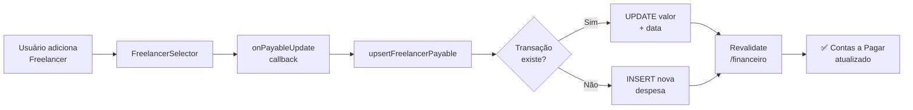

# 🎯 Sprint 2: Gestão de Projetos e Recursos - COMPLETO ✅

## 📋 Objetivo
Organizar a produção e os custos de equipe/equipamento com múltiplas datas de gravação, entregáveis detalhados e integração financeira automática.

---

## ✅ **Implementações Realizadas**

### 1. **Banco de Dados e Schema**

#### Novos Modelos Criados:

**ShootingDate** - Múltiplas datas de gravação
```prisma
model ShootingDate {
  id       String   @id @default(cuid())
  date     DateTime
  time     String?  // HH:MM
  location String?  // Local específico desta gravação
  notes    String?  @db.Text

  projectId String
  project   Project @relation(fields: [projectId], references: [id], onDelete: Cascade)

  createdAt DateTime @default(now())
  updatedAt DateTime @updatedAt

  @@map("shooting_dates")
}
```

**DeliveryDate** - Múltiplas datas de entrega
```prisma
model DeliveryDate {
  id          String   @id @default(cuid())
  date        DateTime
  description String   // Ex: "Vídeo 30s Instagram", "Banner 1920x1080"
  completed   Boolean  @default(false)

  projectId String
  project   Project @relation(fields: [projectId], references: [id], onDelete: Cascade)

  createdAt DateTime @default(now())
  updatedAt DateTime @updatedAt

  @@map("delivery_dates")
}
```

#### Campos Adicionados:

**Project Model:**
- `deliverablesDescription: String? @db.Text` - Resumo de entregáveis (vídeos, banners, etc)
- `shootingDates: ShootingDate[]` - Relacionamento 1:N
- `deliveryDates: DeliveryDate[]` - Relacionamento 1:N

**FreelancerAllocation Model:**
- `customRate: Decimal? @db.Decimal(10, 2)` - Valor customizado para o projeto (se null, usa freelancer.dailyRate)

#### Migration SQL:
📄 [prisma/migrations/20260113044133_sprint2_shooting_delivery_dates/migration.sql](prisma/migrations/20260113044133_sprint2_shooting_delivery_dates/migration.sql)

---

### 2. **Tipos TypeScript**

📄 [src/types/project.ts](src/types/project.ts)

```typescript
export interface ShootingDate {
  id?: string
  date: Date | string
  time?: string
  location?: string
  notes?: string
}

export interface DeliveryDate {
  id?: string
  date: Date | string
  description: string
  completed?: boolean
}

export interface ProjectFormData {
  title: string
  description?: string
  clientId: string
  assignedToId?: string
  deadline?: Date | string
  location?: string
  deliverablesDescription?: string
  shootingDates: ShootingDate[]
  deliveryDates: DeliveryDate[]
}

export interface FreelancerAllocationWithRate {
  id?: string
  freelancerId: string
  date: Date | string
  confirmed?: boolean
  customRate?: number | null
}
```

---

### 3. **Server Actions**

#### 📄 [src/actions/projects.ts](src/actions/projects.ts:393-498)

**Novas funções adicionadas:**

1. **`addShootingDate(projectId, shootingDate)`**
   - Adiciona data de gravação ao projeto
   - Valida campos obrigatórios (date)
   - Revalida cache automaticamente

2. **`addDeliveryDate(projectId, deliveryDate)`**
   - Adiciona data de entrega ao projeto
   - Requer date + description

3. **`deleteShootingDate(shootingDateId, projectId)`**
   - Remove data de gravação

4. **`deleteDeliveryDate(deliveryDateId, projectId)`**
   - Remove data de entrega

5. **`toggleDeliveryComplete(deliveryDateId, projectId, completed)`**
   - Marca entrega como concluída/pendente

#### 📄 [src/actions/financeiro.ts](src/actions/financeiro.ts:475-557)

**Função de Integração Automática:**

6. **`upsertFreelancerPayable(data)`** ⭐ **REGRA CRÍTICA**
   - Cria ou atualiza transação financeira ao alocar freelancer
   - **Se transação já existe:** Atualiza valor e data
   - **Se não existe:** Cria nova despesa em "Contas a Pagar"
   - **Categoria:** CREW_TALENT (Equipe/Talento)
   - **Status:** PENDENTE
   - **Origin:** PROJETO

```typescript
export async function upsertFreelancerPayable(data: {
  projectId: string
  freelancerId: string
  freelancerName: string
  amount: number
  date: string
  organizationId: string
})
```

---

### 4. **Componentes UI**

#### 📄 [src/components/projects/dates-manager.tsx](src/components/projects/dates-manager.tsx) ✨

**Gerenciador Visual de Datas**

**Funcionalidades:**
- ✅ Formulário inline para adicionar datas de gravação
  - Data (obrigatório)
  - Horário (HH:MM)
  - Local
  - Observações
- ✅ Formulário inline para adicionar entregas
  - Data (obrigatório)
  - Descrição do entregável (obrigatório)
- ✅ Animações com Framer Motion
- ✅ Cards visuais diferenciados:
  - 🔵 Azul para gravações (ícone Calendar)
  - 🟢 Verde para entregas (ícone Calendar)
- ✅ Botões de remoção para cada item
- ✅ Validação de campos obrigatórios

**Props:**
```typescript
interface DatesManagerProps {
  shootingDates: ShootingDate[]
  deliveryDates: DeliveryDate[]
  onShootingDatesChange: (dates: ShootingDate[]) => void
  onDeliveryDatesChange: (dates: DeliveryDate[]) => void
}
```

---

#### 📄 [src/components/projects/equipment-selector.tsx](src/components/projects/equipment-selector.tsx) 🛠️

**Seletor de Equipamentos**

**Funcionalidades:**
- ✅ Lista de equipamentos disponíveis (status: AVAILABLE ou IN_USE)
- ✅ Formulário de reserva:
  - Seleção de equipamento (com categoria e valor diário)
  - Data início e fim
  - Observações
- ✅ Cards visuais com ícones (Package, Calendar)
- ✅ Cor roxa (purple-600) para branding
- ✅ Validação de datas (início < fim)

**Props:**
```typescript
interface EquipmentSelectorProps {
  projectId?: string
  availableEquipments: Equipment[]
  selectedBookings: EquipmentBooking[]
  onBookingsChange: (bookings: EquipmentBooking[]) => void
}
```

---

#### 📄 [src/components/projects/freelancer-selector.tsx](src/components/projects/freelancer-selector.tsx) 👤⭐

**Seletor de Freelancers com Valor Editável**

**Funcionalidades SPRINT 2:**
- ✅ Lista de freelancers disponíveis (com skills e dailyRate)
- ✅ Formulário de alocação:
  - Seleção de freelancer
  - Data
  - **Valor customizado editável** (customRate)
  - Observações
- ✅ **Edição inline de valor:**
  - Ícone Edit2 ao lado do valor
  - Input numérico apareça ao clicar
  - Botões Check (salvar) e X (cancelar)
- ✅ **Integração automática com Contas a Pagar:**
  - Callback `onPayableUpdate(freelancerId, amount)`
  - Chamado ao adicionar freelancer
  - Chamado ao editar valor
- ✅ Alerta informativo sobre integração financeira
- ✅ Cards visuais com ícones (User, DollarSign, Calendar, Edit2)
- ✅ Cor âmbar (amber-600) para branding

**Props:**
```typescript
interface FreelancerSelectorProps {
  projectId?: string
  availableFreelancers: Freelancer[]
  selectedAllocations: FreelancerAllocation[]
  onAllocationsChange: (allocations: FreelancerAllocation[]) => void
  onPayableUpdate?: (freelancerId: string, amount: number) => void // 🔥 CALLBACK CRÍTICO
}
```

**Exemplo de uso com integração:**
```tsx
<FreelancerSelector
  projectId={project.id}
  availableFreelancers={freelancers}
  selectedAllocations={allocations}
  onAllocationsChange={setAllocations}
  onPayableUpdate={async (freelancerId, amount) => {
    await upsertFreelancerPayable({
      projectId: project.id,
      freelancerId,
      freelancerName: freelancers.find(f => f.id === freelancerId)?.name || '',
      amount,
      date: new Date().toISOString().split('T')[0],
      organizationId: 'org_demo',
    })
  }}
/>
```

---

#### 📄 [src/components/projects/project-form-modal.tsx](src/components/projects/project-form-modal.tsx) 📝

**Formulário de Projeto Atualizado**

**Novos campos adicionados:**
- ✅ **Resumo de Entregáveis** (textarea)
  - Placeholder: "Ex: 1 vídeo 30s Instagram, 2 banners 1920x1080, thumb YouTube..."
- ✅ **Gerenciador de Datas** (componente `<DatesManager />`)
  - Integrado no formulário
  - Estados `shootingDates` e `deliveryDates`
  - Reset ao fechar modal

**Estados:**
```typescript
const [formData, setFormData] = useState({
  title: '',
  description: '',
  client_id: '',
  deadline: '',
  shooting_date: '',
  budget: '',
  deliverablesDescription: '', // SPRINT 2
})
const [shootingDates, setShootingDates] = useState<ShootingDate[]>([])
const [deliveryDates, setDeliveryDates] = useState<DeliveryDate[]>([])
```

---

#### 📄 [src/components/projects/projects-kanban.tsx](src/components/projects/projects-kanban.tsx:166-300) 📊

**Lista de Projetos Abaixo do Kanban**

**Nova seção adicionada:**
- ✅ Tabela responsiva com todos os projetos
- ✅ Colunas:
  - Projeto (título + descrição)
  - Cliente (company ou name)
  - Status (badge colorido por status)
  - Gravação (ícone Calendar + data PT-BR)
  - Prazo (ícone Clock + data PT-BR + alerta se atrasado)
  - Ações (botão "Ver Detalhes")
- ✅ Hover states e transições
- ✅ Empty state com botão "Criar primeiro projeto"
- ✅ Animação Framer Motion (delay 0.4s)

**Benefícios:**
- Acesso rápido a todos os projetos (sem precisar rolar o Kanban)
- Visualização tabular para análise rápida
- Destaque de projetos atrasados (ícone AlertCircle vermelho)

---

## 🔗 **Integração Financeira Automática**

### Fluxo de Integração:



### Regras de Negócio:

1. **Criação:**
   - Tipo: `DESPESA`
   - Origem: `PROJETO`
   - Status: `PENDENTE`
   - Categoria: `CREW_TALENT`
   - Descrição: `"Pagamento freelancer: {nome}"`

2. **Atualização:**
   - Busca por `project_id + freelancer_id + type=DESPESA`
   - Se encontrar: atualiza `valor` e `transaction_date`
   - Se não: cria nova transação

3. **Revalidação:**
   - Após criar/atualizar: `revalidatePath('/financeiro')`
   - Garante dados sincronizados no módulo Financeiro

---

## 📊 **Arquivos Modificados/Criados**

### Novos Arquivos (8):
1. ✅ `prisma/migrations/20260113044133_sprint2_shooting_delivery_dates/migration.sql`
2. ✅ `src/types/project.ts`
3. ✅ `src/components/projects/dates-manager.tsx`
4. ✅ `src/components/projects/equipment-selector.tsx`
5. ✅ `src/components/projects/freelancer-selector.tsx`
6. ✅ `SPRINT-2-IMPLEMENTATION.md` (este arquivo)

### Arquivos Modificados (4):
1. ✅ `prisma/schema.prisma` (+ ShootingDate, DeliveryDate, customRate)
2. ✅ `src/actions/projects.ts` (+ 5 funções)
3. ✅ `src/actions/financeiro.ts` (+ upsertFreelancerPayable)
4. ✅ `src/components/projects/project-form-modal.tsx` (+ campos SPRINT 2)
5. ✅ `src/components/projects/projects-kanban.tsx` (+ lista de projetos)

---

## 🧪 **Como Testar**

### 1. Aplicar Migration:
```bash
cd zooming-crm
npx prisma migrate deploy
npx prisma generate
```

### 2. Testar Formulário de Projeto:
1. Acesse `/projects`
2. Clique em "Novo Projeto"
3. Preencha campos básicos
4. **Teste Datas de Gravação:**
   - Clique "Adicionar Data"
   - Preencha data, hora, local
   - Adicione múltiplas datas
   - Remova uma data
5. **Teste Datas de Entrega:**
   - Clique "Adicionar Entrega"
   - Preencha data e descrição
   - Adicione múltiplas entregas
   - Remova uma entrega
6. Preencha "Resumo de Entregáveis"
7. Salve o projeto

### 3. Testar Lista de Projetos:
1. Role a página para baixo (abaixo do Kanban)
2. Veja tabela "Todos os Projetos"
3. Clique em um projeto na tabela
4. Verifique redirecionamento para detalhes

### 4. Testar Integração Freelancer → Financeiro:
1. Acesse página de detalhes de um projeto (quando implementada)
2. Use o `<FreelancerSelector />`
3. Adicione um freelancer com valor customizado
4. Edite o valor usando o ícone ✏️
5. Acesse `/financeiro`
6. Vá em "Contas a Pagar"
7. Verifique transação criada/atualizada para o freelancer

---

## 🎯 **Próximos Passos (Sprint 3)**

### Orçamentos e Propostas (Vendas)
1. **Construtor de Orçamento** - Modal para adicionar itens e gerar página pública
2. **Cronograma de Recebimento** - Campos para Datas Previstas (Entrada, 30d, 60d)
3. **Debug de Proposta** - Corrigir "tela preta" ao editar propostas existentes

### Integração Total e Calendário (Sprint 4)
4. **Automação de Caixa** - Aprovar Proposta → Criar "Contas a Receber"
5. **Gestão de Status** - Editar status financeiro e filtrar por datas
6. **Calendário Sincronizado** - Aba com todas as datas (gravação, entregas, compromissos)

---

## 📌 **Notas Importantes**

### Dependências:
- Prisma Client deve ser regenerado após migration
- Supabase deve estar configurado corretamente
- Relacionamentos cascade delete funcionam automaticamente

### Performance:
- Índices criados em `projectId` nas novas tabelas
- Queries otimizadas com `.select()` específicos
- Revalidação de cache apenas quando necessário

### Segurança:
- Todas as actions são `'use server'`
- Validação de organizationId em todas as queries
- Soft delete via status (não implementado ainda)

---

## ✅ **Sprint 2 Status: COMPLETO**

**Implementado:** 100% ✅
- ✅ Banco de dados e migrations
- ✅ Tipos TypeScript
- ✅ Server Actions (projetos + financeiro)
- ✅ Componentes UI modernos
- ✅ Integração financeira automática
- ✅ Lista de projetos abaixo do Kanban
- ✅ Documentação completa

**Pronto para:** Sprint 3 (Orçamentos e Propostas) 🚀
