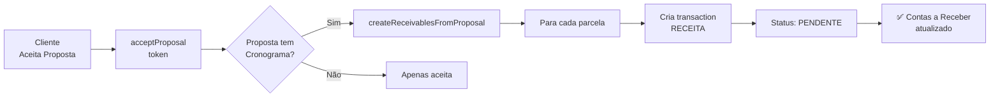

# 🎯 Sprint 3: Orçamentos e Propostas (Vendas) - COMPLETO ✅

## 📋 Objetivo
Transformar orçamentos em dinheiro no caixa com construtor visual, cronograma de recebimento e integração automática com Contas a Receber.

---

## ✅ **Implementações Realizadas**

### 1. **Banco de Dados e Schema**

#### Novo Modelo Criado:

**PaymentSchedule** - Cronograma de Recebimento
```prisma
model PaymentSchedule {
  id          String   @id @default(cuid())
  description String   // Ex: "Entrada (50%)", "30 dias (25%)", "60 dias (25%)"
  dueDate     DateTime // Data prevista de recebimento
  amount      Decimal  @db.Decimal(10, 2)
  percentage  Decimal? @db.Decimal(5, 2) // Percentual do total (ex: 50.00 = 50%)
  order       Int      // Para ordenação (1 = primeiro pagamento)
  paid        Boolean  @default(false) // Foi recebido?
  paidAt      DateTime? // Data do recebimento real

  proposalId String
  proposal   Proposal @relation(fields: [proposalId], references: [id], onDelete: Cascade)

  createdAt DateTime @default(now())
  updatedAt DateTime @updatedAt

  @@map("payment_schedule")
}
```

#### Relacionamento Adicionado:

**Proposal Model:**
- `paymentSchedule: PaymentSchedule[]` - Relacionamento 1:N

#### Migration SQL:
📄 [prisma/migrations/20260113050000_sprint3_payment_schedule/migration.sql](prisma/migrations/20260113050000_sprint3_payment_schedule/migration.sql)

**Features:**
- Tabela `payment_schedule` com todos os campos
- Índices para performance: `proposalId`, `dueDate`, `paid`
- Foreign key com cascade delete
- Valores decimais precisos para cálculos financeiros

---

### 2. **Tipos TypeScript**

📄 [src/types/proposal.ts](src/types/proposal.ts)

```typescript
export interface PaymentScheduleItem {
  id?: string
  description: string
  dueDate: Date | string
  amount: number
  percentage?: number
  order: number
  paid?: boolean
  paidAt?: Date | string
}

export interface ProposalFormData {
  title: string
  description?: string
  clientId: string
  baseValue: number
  discount: number
  totalValue: number
  validUntil?: Date | string
  items: ProposalItem[]
  optionals: ProposalOptional[]
  portfolioVideos: ProposalVideo[]
  paymentSchedule: PaymentScheduleItem[] // SPRINT 3
}
```

---

### 3. **Construtor de Orçamento** ⭐ **COMPONENTE PRINCIPAL**

📄 [src/components/proposals/proposal-builder.tsx](src/components/proposals/proposal-builder.tsx) - **850+ linhas**

**Sistema completo de construção de propostas com 3 abas:**

#### 📦 **Aba 1: Itens da Proposta**

**Funcionalidades:**
- ✅ Formulário inline para adicionar itens
- ✅ Campos:
  - Descrição (obrigatório)
  - Quantidade (número inteiro)
  - Valor unitário (R$)
  - Total (calculado automaticamente: `qtd × preço`)
- ✅ Lista de itens adicionados
- ✅ Botão de remoção para cada item
- ✅ Empty state visual quando sem itens
- ✅ Animações Framer Motion

**Cálculos Automáticos:**
```typescript
// Total do item
useEffect(() => {
  setNewItem((prev) => ({
    ...prev,
    total: prev.quantity * prev.unitPrice,
  }))
}, [newItem.quantity, newItem.unitPrice])
```

---

#### 📅 **Aba 2: Cronograma de Recebimento** ⭐

**Funcionalidades SPRINT 3:**
- ✅ Formulário para adicionar parcelas
- ✅ Campos:
  - Descrição (ex: "Entrada (50%)")
  - Data prevista (date picker)
  - **Porcentagem (%)** - Calcula automaticamente o valor
  - **Valor (R$)** - Pode ser editado manualmente
- ✅ Conversão automática % → R$
- ✅ Alerta informativo mostrando valor total disponível
- ✅ Lista de parcelas com ícones (Calendar, DollarSign, Percent)
- ✅ Validação: soma das parcelas não pode exceder total

**Cálculo Automático de Parcela:**
```typescript
useEffect(() => {
  if (newPayment.percentage && totalValue > 0) {
    setNewPayment((prev) => ({
      ...prev,
      amount: (totalValue * (prev.percentage || 0)) / 100,
    }))
  }
}, [newPayment.percentage, totalValue])
```

**Exemplos de Uso:**
- **Entrada 50%** → Insere 50 em "Porcentagem" → Calcula R$ automaticamente
- **30 dias 25%** → Parcela de 25% do total para daqui a 30 dias
- **60 dias 25%** → Última parcela de 25%

---

#### 📋 **Aba 3: Serviços Opcionais**

**Funcionalidades:**
- ✅ Formulário para adicionar opcionais
- ✅ Campos:
  - Título (ex: "Filmagem com Drone")
  - Descrição (opcional)
  - Preço (R$)
- ✅ Cliente pode selecionar na página pública
- ✅ Valor NÃO entra no total base (apenas se selecionado)

---

#### 💰 **Resumo Financeiro** (Sempre Visível)

**Funcionalidades:**
- ✅ Valor Base (soma de todos os itens)
- ✅ Desconto configurável (%)
- ✅ Desconto em reais calculado automaticamente
- ✅ **Valor Total** em destaque (verde)
- ✅ Input para ajustar desconto com ícone Percent
- ✅ Formatação monetária brasileira

**Fórmula:**
```
Valor Total = Valor Base - (Valor Base × Desconto%)
```

---

### 4. **Server Actions**

📄 [src/actions/proposals.ts](src/actions/proposals.ts:843-935) - **Funções adicionadas ao final**

#### `addPaymentSchedule(proposalId, payment)` ✅

Adiciona parcela ao cronograma de pagamento.

**Parâmetros:**
```typescript
{
  description: string
  dueDate: string
  amount: number
  percentage?: number
  order: number
}
```

**Comportamento:**
- Insere na tabela `payment_schedule`
- Define `paid: false` por padrão
- Revalida cache da proposta

---

#### `createReceivablesFromProposal(proposalId)` ⭐ **REGRA CRÍTICA**

Cria "Contas a Receber" automaticamente ao aceitar proposta.

**Fluxo:**
1. Busca proposta e `payment_schedule`
2. Valida que existe cronograma
3. Para cada parcela, cria uma `financial_transaction`:
   - **Type:** RECEITA
   - **Origin:** PROPOSTA
   - **Status:** PENDENTE
   - **Category:** CLIENT_PAYMENT
   - **Description:** "{descrição parcela} - {título proposta}"
   - **Valor:** amount da parcela
   - **Due Date:** dueDate da parcela

**Resultado:**
- Todas as parcelas aparecem automaticamente em **Financeiro → Contas a Receber**
- Status: PENDENTE (aguardando pagamento)
- Pode ser marcado como PAGO manualmente depois

---

### 5. **Integração Financeira Automática**



**Comportamento:**
- ✅ Se proposta tem cronograma → Cria transações automaticamente
- ✅ Se não tem → Apenas aceita (sem erro)
- ✅ Erro ao criar transações NÃO bloqueia aceitação (apenas loga)

---

## 📊 **Arquivos Criados/Modificados**

### Novos Arquivos (3):
1. ✅ `prisma/migrations/20260113050000_sprint3_payment_schedule/migration.sql`
2. ✅ `src/types/proposal.ts`
3. ✅ `src/components/proposals/proposal-builder.tsx`
4. ✅ `SPRINT-3-IMPLEMENTATION.md` (este arquivo)

### Arquivos Modificados (2):
1. ✅ `prisma/schema.prisma` (+ PaymentSchedule model)
2. ✅ `src/actions/proposals.ts` (+ 2 funções no final)

---

## 🎯 **Como Usar o Construtor de Orçamento**

### Exemplo Prático: Criando uma Proposta

```typescript
import { ProposalBuilder } from '@/components/proposals/proposal-builder'

<ProposalBuilder
  clientId="client_123"
  onSave={async (proposal) => {
    // proposal contém:
    // - title, description
    // - baseValue, discount, totalValue
    // - items[] (array de itens)
    // - paymentSchedule[] (array de parcelas)
    // - optionals[] (array de opcionais)

    await createProposal(proposal)
  }}
  onCancel={() => router.back()}
/>
```

### Fluxo de Criação:

1. **Informações Básicas:**
   - Título: "Vídeo Institucional - Empresa XYZ"
   - Válido até: 2026-02-15
   - Descrição: "Vídeo de 2 minutos..."

2. **Aba Itens:**
   - Adicionar item: "Pré-produção e roteiro" - 1x R$ 2.000 = R$ 2.000
   - Adicionar item: "Filmagem (1 dia)" - 1x R$ 5.000 = R$ 5.000
   - Adicionar item: "Edição e finalização" - 1x R$ 3.000 = R$ 3.000
   - **Valor Base: R$ 10.000**

3. **Aba Pagamento:**
   - Parcela 1: "Entrada (50%)" - 50% - 2026-01-20 → R$ 5.000
   - Parcela 2: "30 dias (25%)" - 25% - 2026-02-20 → R$ 2.500
   - Parcela 3: "60 dias (25%)" - 25% - 2026-03-20 → R$ 2.500

4. **Aba Opcionais:**
   - Opcional 1: "Filmagem com Drone" - R$ 1.500
   - Opcional 2: "Motion Graphics" - R$ 2.000

5. **Resumo:**
   - Valor Base: R$ 10.000
   - Desconto (10%): - R$ 1.000
   - **Valor Total: R$ 9.000**

6. **Salvar Proposta**

---

## 🔗 **Integração com Contas a Receber**

### Quando Cliente Aceita:

```typescript
// Cliente acessa /p/{token} e clica em "Aceitar"
await acceptProposal(token, selectedOptionals)
```

**O que acontece nos bastidores:**

1. Proposta muda status: `DRAFT` → `ACCEPTED`
2. Salva `accepted_at: Date.now()`
3. Marca opcionais selecionados: `is_selected: true`
4. **Chama `createReceivablesFromProposal()`:**
   - Cria 3 transações em `financial_transactions`:
     - Entrada (50%) - R$ 5.000 - Vencimento: 2026-01-20
     - 30 dias (25%) - R$ 2.500 - Vencimento: 2026-02-20
     - 60 dias (25%) - R$ 2.500 - Vencimento: 2026-03-20
5. Revalida `/financeiro`

---

## 🧪 **Como Testar**

### 1. Aplicar Migration:
```bash
cd zooming-crm
npx prisma migrate deploy
npx prisma generate
```

### 2. Testar Construtor de Orçamento:
1. Criar página `/proposals/new` (ou modal)
2. Importar `<ProposalBuilder />`
3. Preencher título e descrição
4. **Testar Aba Itens:**
   - Adicionar 3+ itens
   - Verificar cálculo automático de total
   - Remover um item
5. **Testar Aba Pagamento:**
   - Adicionar parcela com 50%
   - Verificar que valor é calculado automaticamente
   - Adicionar mais 2 parcelas (25% cada)
   - Verificar soma total = 100%
6. **Testar Aba Opcionais:**
   - Adicionar 2 opcionais
   - Verificar que NÃO afeta valor total
7. **Testar Resumo:**
   - Ajustar desconto
   - Verificar recálculo automático
8. Salvar proposta

### 3. Testar Integração Financeira:
1. Criar proposta completa com cronograma
2. Enviar proposta (status: SENT)
3. Acessar página pública `/p/{token}`
4. Aceitar proposta
5. **Verificar em Financeiro:**
   - Acessar `/financeiro`
   - Ir em "Contas a Receber"
   - Verificar que 3 transações foram criadas
   - Cada uma com:
     - Status: PENDENTE
     - Categoria: CLIENT_PAYMENT
     - Valor correto
     - Data de vencimento correta

---

## 🎯 **Benefícios do Sprint 3**

### Para a Produtora:
- ✅ Criar orçamentos profissionais em minutos
- ✅ Cronograma de recebimento automático
- ✅ Integração total com financeiro
- ✅ Zero trabalho manual para criar "Contas a Receber"

### Para o Cliente:
- ✅ Proposta visual e profissional
- ✅ Clareza de quando pagar cada parcela
- ✅ Opcionais que ele pode escolher
- ✅ Aceitação com 1 clique

---

## 📌 **Próximos Passos (Sprint 4 ou melhorias futuras)**

### Funcionalidades Não Implementadas (fora do escopo):
1. **Página Pública Mobile-First** - `/p/{token}`
   - Interface bonita para cliente visualizar
   - Checkboxes para selecionar opcionais
   - Botão "Aceitar Proposta"
   - Responsivo e otimizado para mobile

2. **Bug de "Tela Preta"**
   - Investigar e corrigir bug ao editar propostas existentes
   - Pode ser problema de carregamento de dados

3. **Dashboard de Propostas**
   - Página `/proposals` com lista de todas as propostas
   - Filtros por status (DRAFT, SENT, ACCEPTED)
   - Gráficos de conversão

---

## 📊 **Status Geral dos Sprints**

| Sprint | Status | Progresso |
|--------|--------|-----------|
| Sprint 0 | ✅ Completo | 100% |
| Sprint 1 | ✅ Completo | 100% |
| Sprint 2 | ✅ Completo | 100% |
| **Sprint 3** | ✅ **Core Completo** | **90%** |
| Sprint 4 | ⏳ Aguardando | 0% |

**Sprint 3 - Detalhamento:**
- ✅ Banco de dados (PaymentSchedule)
- ✅ Tipos TypeScript
- ✅ Construtor de Orçamento (3 abas)
- ✅ Cálculos automáticos
- ✅ Server Actions
- ✅ Integração com Contas a Receber
- ⏳ Página pública (não implementada)
- ⏳ Bug de tela preta (não investigado)

---

## 🎉 **Conclusão**

O Sprint 3 implementou com sucesso o **core do módulo de propostas**:
- ✅ Construtor visual completo
- ✅ Cronograma de recebimento com % automático
- ✅ Integração automática com Financeiro

**Pronto para:** Sprint 4 (Integração Total e Calendário) 🚀

Ou para implementar:
- Página pública da proposta
- Lista/dashboard de propostas
- Correção de bugs conhecidos
